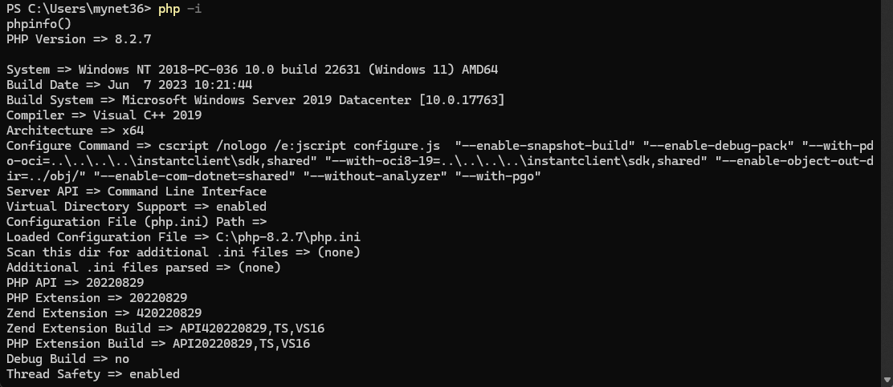
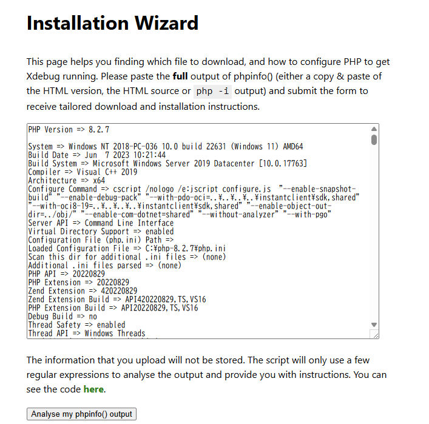
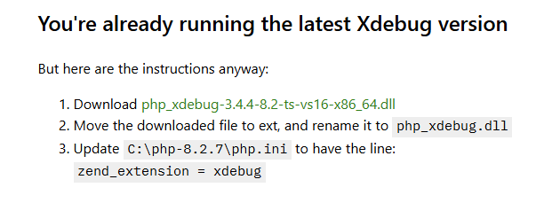
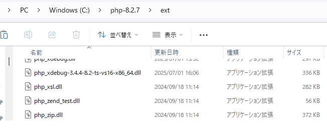
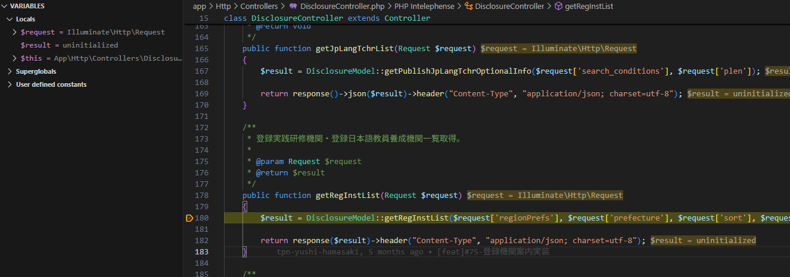

# PHPデバッグツール

1. [https://xdebug.org/wizard](https://xdebug.org/wizard) からdllファイルをダウンロード
   1. powershell等で`php -i`を実行
      
   2. `php -i`の出力を全てcopy & pasteし、「Analyse my phpinfo() output」ボタン押下
      
   3. 表示されたリンクからdllファイルダウンロード
      
2. ダウンロードしたファイルをphpをインストールしたフォルダの`ext`内に配置
   
3. `php.ini`ファイルに以下を追記する。

   * zend_extensionには2.で配置したdllファイルのフルパスを記載する。
   * xdebug.client_portには

   ```ini
   [xdebug]
   zend_extension="C:\php-8.2.7\ext\php_xdebug-3.4.4-8.2-ts-vs16-x86_64.dll"
   xdebug.mode=debug
   xdebug.start_with_request = yes
   xdebug.discover_client_host = 0
   xdebug.client_port=9000
   ```

4. VScodeに[PHPdebug](https://marketplace.visualstudio.com/items?itemName=xdebug.php-debug)の拡張機能を追加

5. プロジェクトのディレクトリを開き、`.vscode/launch.json`を下記内容で作成

   * portは`php.ini`に記載した`xdebug.client_port`と合わせる。

   ```json
   {
      "version": "0.2.0",
      "configurations": [
         {
               "name": "Listen for Xdebug",
               "type": "php",
               "request": "launch",
               "port": 9000
         }
      ]
   }
   ```

6. F5ボタンで実行し、`php artisan serve`を実行

   * ブレークポイントを設定し、デバッグ可能。
      
